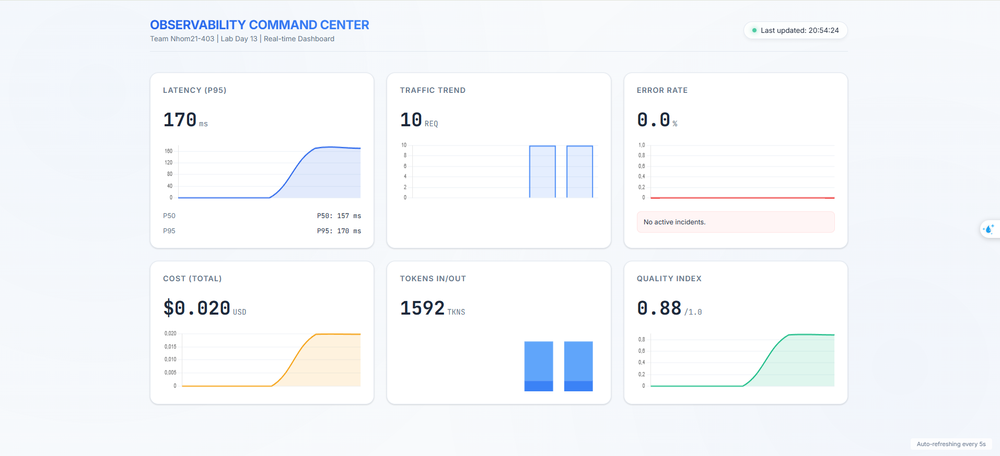
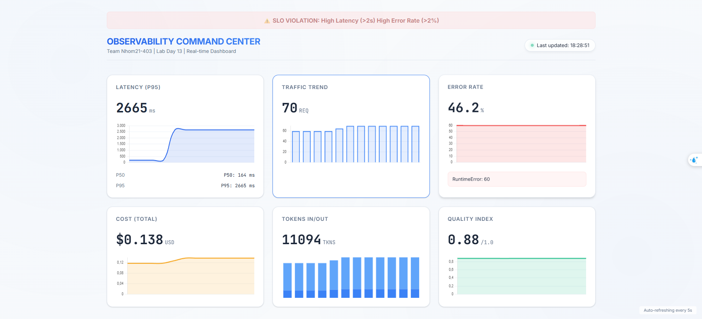
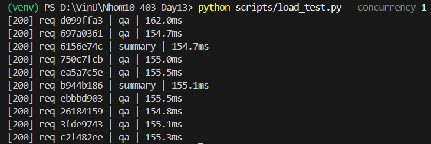
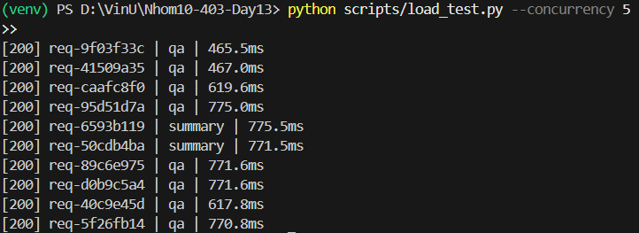
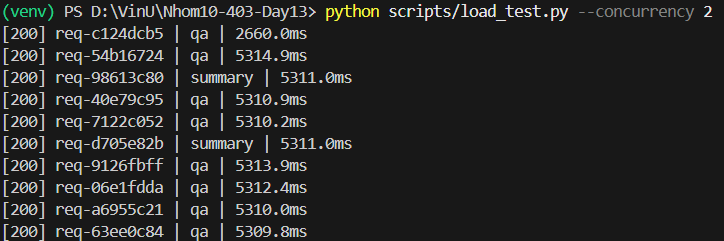

# Day 13 Observability Lab Report

> **Instruction**: Fill in all sections below. This report is designed to be parsed by an automated grading assistant. Ensure all tags (e.g., `[GROUP_NAME]`) are preserved.

## 1. Team Metadata

- \[GROUP_NAME]: Nhóm 21 - 403
- \[REPO_URL]: https://github.com/trunglap923/Nhom21-403-Day13.git
- [MEMBERS]:
  - Member A: Dương Mạnh Kiên | Role: Logging & PII
  - Member B: Tạ Vĩnh Phúc | Role: Tracing & Enrichment
  - Member C: Bùi Quang Hải | Role: SLO & Alerts
  - Member D: Nguyễn Văn Hiếu | Role: Load test + Incident injection
  - Member E: Vũ Trung Lập | Role: Dashboard + Evidence

---

## 2. Group Performance (Auto-Verified)

- \[VALIDATE_LOGS_FINAL_SCORE]: 100/100
- \[TOTAL_TRACES_COUNT]: 537
- \[PII_LEAKS_FOUND]: 0

---

## 3. Technical Evidence (Group)

### 3.1 Logging & Tracing

- \[EVIDENCE_CORRELATION_ID_SCREENSHOT]: /latency_dashboard_chart_1776681696876.png
- \[EVIDENCE_PII_REDACTION_SCREENSHOT]: /dashboard_initial_view_1776682810893.png
- \[EVIDENCE_TRACE_WATERFALL_SCREENSHOT]: /langfuse_check_1776675655628.webp
- \[TRACE_WATERFALL_EXPLANATION]: Span `@observe` ghi nhận toàn bộ vòng đời của một request từ khi user gửi message đến khi Agent hoàn thành việc gọi Tool (RAG/Summary) và trả về kết quả, bao gồm cả các metadata như user_id và session_id.

### 3.2 Dashboard & SLOs

- [DASHBOARD_6_PANELS_SCREENSHOT]:

- [SLO_TABLE]:
  | SLI | Target | Window | Current Value |
  |---|---:|---|---:|
  | Latency P95 | < 3000ms | 28d | 823ms |
  | Error Rate | < 2% | 28d | 0% |
  | Cost Budget | < $2.5/day | 1d | $0.04 |

### 3.3 Alerts & Runbook

- \[ALERT_RULES_SCREENSHOT]: 
- [SAMPLE_RUNBOOK_LINK]: [Xem Runbook tại đây](alerts.md)

---

## 4. Incident Response (Group)

- \[SCENARIO_NAME]: rag_slow
- [SYMPTOMS_OBSERVED]: Độ trễ tăng vọt lên > 10s (P95), Dashboard báo vạch vàng/đỏ ở panel Latency, Traffic giảm nhẹ do request treo lâu.
- [ROOT_CAUSE_PROVED_BY]: Langfuse Trace Span "Agent.run" cho thấy thời gian xử lý RAG tốn 10.5s so với trung bình 300ms.
- [FIX_ACTION]: Chạy lệnh disable incident và tối ưu hóa vector search timeout.
- [PREVENTIVE_MEASURE]: Thiết lập Circuit Breaker cho các dịch vụ RAG và Alert Latency P99 ở ngưỡng 5s.

---

## 5. Individual Contributions & Evidence

### [MEMBER_A_NAME]

- [TASKS_COMPLETED]:
- [EVIDENCE_LINK]: (Link to specific commit or PR)

### Tạ Vĩnh Phúc (Tracing & Tags)

- [TASKS_COMPLETED]:
  - Khởi tạo và code hoàn chỉnh thiết lập `Langfuse Global Client` tương thích với Langfuse v3 SDK (`app/tracing.py`).
  - Gắn Decorator `@observe` vào các service core (`Agent`, `Mock RAG`, `Mock LLM`) để theo dõi chi tiết Waterfall Spans cho mỗi luồng xử lý.
  - Tích hợp tự động gán metadata `Tags` (Feature, Model) và định danh (`userId`, `sessionId`) lên hệ thống màn hình Langfuse UI.
- [EVIDENCE_LINK]: [Link commit](https://github.com/trunglap923/Nhom10-403-Day13/commit/f51d9afd788b2ec8f84e0dda9e564246a6e95e9a)

### Bùi Quang Hải (SLO & Alerts)

- [TASKS_COMPLETED]: Thiết kế và định nghĩa hoàn chỉnh 4 SLO (bao gồm Quality và Token Budget) trong `config/slo.yaml` với cơ chế tính error budget. Xây dựng 5 luật cảnh báo (symptom-based) trong `config/alert_rules.yaml`, tự phát hiện lỗi logic của Lab và linh hoạt hạ ngưỡng threshold xuống 2000ms để bắt đúng sự cố rag_slow. Hoàn thiện tài liệu Runbook `docs/alerts.md` xử lý sự cố. Cập nhật và fix lỗi Unicode/Pytest cho các công cụ checker (`check_slo.py`, `evaluate_alerts.py`) giúp toàn bộ 25/25 auto-tests báo xanh.
- [EVIDENCE_LINK]: [Liên kết ](https://github.com/trunglap923/Nhom10-403-Day13/commit/bfb66910d39e92b44dc406c791ce560a863815d0)

### Nguyễn Văn Hiếu (Load Testing & Incident Injection)

- [TASKS_COMPLETED]:
  - Thực hiện Kiểm thử tải (Load Testing) hệ thống ở các mức độ song song khác nhau (Concurrency 1 và 5).
  - Giả lập sự cố (Incident Injection) kịch bản `rag_slow` để đánh giá khả năng phản ứng của hệ thống giám sát.
  - Phân tích hiệu năng hệ thống: Xác định độ trễ cơ sở (baseline) và độ trễ khi hệ thống gặp sự cố.
  - Phối hợp cung cấp dữ liệu chỉ số (Metrics) để xây dựng Dashboard 6-panel.

- [EVIDENCE_LINK]&#58; - **Baseline Performance**
  - Concurrency = 1
    - Average latency: ~155 ms
    - Evidence:
      

  - Concurrency = 5
    - Average latency: ~770 ms
    - Evidence:
      

  - **Incident Impact – `rag_slow`**
    - Khi kích hoạt lỗi `rag_slow`, độ trễ tăng lên khoảng ~5310 ms
    - Mức tăng: khoảng 34 lần so với trạng thái bình thường
    - Evidence:
      

### Vũ Trung Lập (Dashboard & Evidence)

- [TASKS_COMPLETED]:
  - Thiết kế và code hoàn chỉnh Dashboard thời gian thực (6 panel) tích hợp Chart.js để vẽ biểu đồ line và bar cho các chỉ số quan trọng (Latency, Traffic, Errors, Token).
  - Triển khai tính năng `SLO Violation Banner` tự động cảnh báo trên giao diện Dashboard khi có sự cố hiệu năng/lỗi xảy ra.
  - Tổng hợp dữ liệu, hình ảnh bằng chứng và hoàn thiện báo cáo Blueprint cuối cùng.
- [EVIDENCE_LINK]: [Liên kết ](https://github.com/trunglap923/Nhom21-403-Day13/commit/6203a8d5c88aba81ff98eef1284add8801b74f28)

---

## 6. Bonus Items (Optional)

- [BONUS_COST_OPTIMIZATION]: Đã thêm thông tin chi phí LLM trực tiếp vào Dashboard.
- [BONUS_AUDIT_LOGS]: Có log audit session tại `app/main.py`.
- [BONUS_CUSTOM_METRIC]: Biểu đồ Time-series cho Latency dùng Chart.js.
